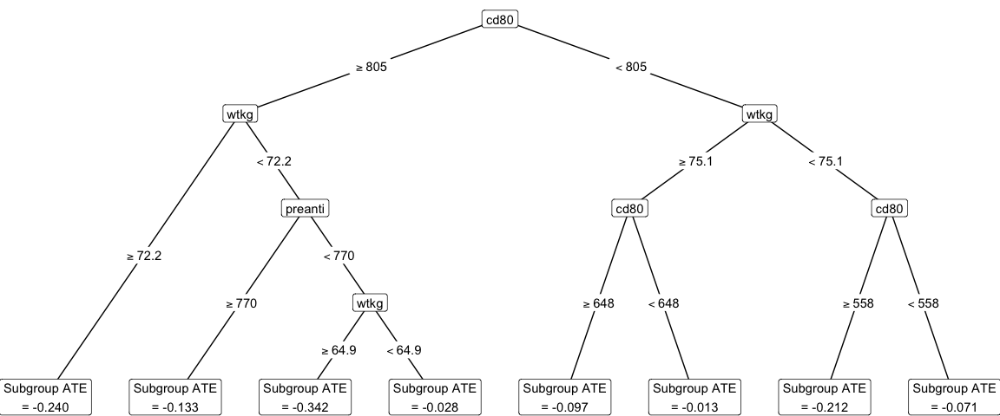
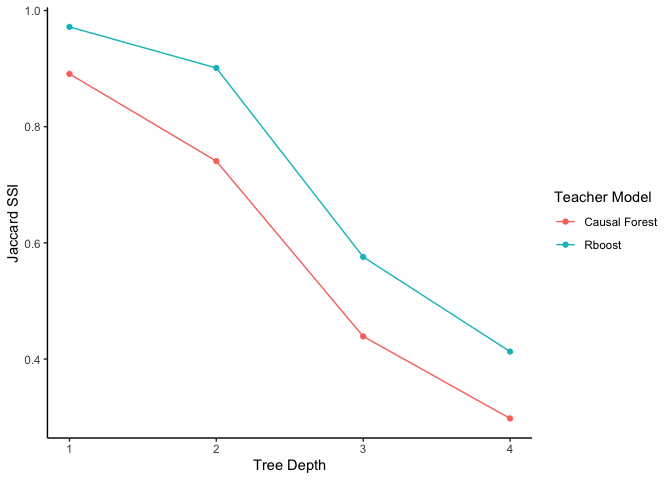

<!-- README.md is generated from README.Rmd. Please edit that file -->

# Causal Distillation Trees

[Causal Distillation Trees](https://arxiv.org/abs/2502.07275) (CDT) is a
novel machine learning method for estimating interpretable subgroups in
causal inference. CDT allows researchers to fit *any* machine learning
model of their choice to estimate the individual-level treatment effect,
and then leverages a simple, second-stage tree-based model to “distill”
the estimated treatment effect into meaningful subgroups. As a result,
CDT inherits the improvements in predictive performance from black-box
machine learning models while preserving the interpretability of a
simple decision tree.


Briefly, CDT is a two-stage learner that first fits a teacher model
(e.g., a black-box metalearner) to estimate individual-level treatment
effects and secondly fits a student model (e.g., a decision tree) to
predict the estimated individual-level treatment effects, in effect
distilling the estimated individual-level treatment effects and
producing interpretable subgroups. This two-stage learner is learned
using the training data. Finally, using the estimated subgroups, the
subgroup average treatment effects are honestly estimated with a
held-out estimation set.

For more details, check out [Huang, M., Tang, T. M., Kenney, A. M.
“Distilling heterogeneous treatment effects: Stable subgroup estimation
in causal inference.” (2025).](https://arxiv.org/abs/2502.07275)

## Organization

This repository contains:

1.  An R package `causalDT` to run causal distillation trees on your own
    data (see [causalDT/](causalDT/))
2.  All code necessary to reproduce the analysis and figures in [Huang
    et al. (2025)](https://arxiv.org/abs/2502.07275) (see
    [causalDT-manuscript/](causalDT-manuscript/) and additional results [here](https://tiffanymtang.github.io/causalDT/simulation_results.html))

## Installation of the R package

You can install the `causalDT` R package via:

``` r
# install.packages("devtools")
devtools::install_github("tiffanymtang/causalDT", subdir = "causalDT")
```

## Example Usage

To illustrate an example usage of `causalDT`, we will use the AIDS
Clinical Trials Group Study 175 (ACTG 175), a randomized controlled
trial to determine the effectiveness of monotherapy compared to
combination therapy on HIV-1-infected patients. This data can be found
in the `speff2trial` R package.

``` r
# install.packages("speff2trial")
library(speff2trial)
#> Loading required package: leaps
#> Loading required package: survival
library(dplyr)
#> 
#> Attaching package: 'dplyr'
#> The following objects are masked from 'package:stats':
#> 
#>     filter, lag
#> The following objects are masked from 'package:base':
#> 
#>     intersect, setdiff, setequal, union

data <- speff2trial::ACTG175 |>
  dplyr::filter(arms %in% c(0, 2))

# pre-treatment covariates data
X <- data |> 
  dplyr::select(
    age, wtkg, hemo, homo, drugs, karnof, race, 
    gender, symptom, preanti, strat, cd80
  ) |> 
  as.matrix()
# treatment indicator variable
Z <- data |>
  dplyr::pull(treat)
# response variable
Y <- data |>
  dplyr::pull(cens)
```

Given the pre-treatment covariates data $X$, the treatment variable $Z$,
and the response variable $Y$, we can run CDT as follows:

``` r
library(causalDT)

set.seed(331)
causal_forest_cdt <- causalDT(
  X = X, Y = Y, Z = Z,
  teacher_model = "causal_forest"
)

plot_cdt(causal_forest_cdt)
```

<!-- -->

Note that when using CDT, a teacher model must be chosen (the default is
a causal forest). To help researchers select an appropriate teacher
model, the Jaccard subgroup stability index (SSI) was introduced in
[Huang et al. (2025)](https://arxiv.org/abs/2502.07275). Generally, a
higher Jaccard SSI indicates a better teacher model. This teacher model
selection procedure can be run as follows:

``` r
# selecting between causal forest versus rboost
rboost_cdt <- causalDT(
  X = as.matrix(X), Y = Y, Z = Z,
  teacher_model = rboost
)
plot_jaccard(`Causal Forest` = causal_forest_cdt, `Rboost` = rboost_cdt)
```

<!-- -->

## Citation

    @article{huang2025distilling,
      title={Distilling heterogeneous treatment effects: Stable subgroup estimation in causal inference}, 
      author={Melody Huang and Tiffany M. Tang and Ana M. Kenney},
      year={2025},
      eprint={2502.07275},
      archivePrefix={arXiv},
      primaryClass={stat.ME},
      url={https://arxiv.org/abs/2502.07275}, 
    }
